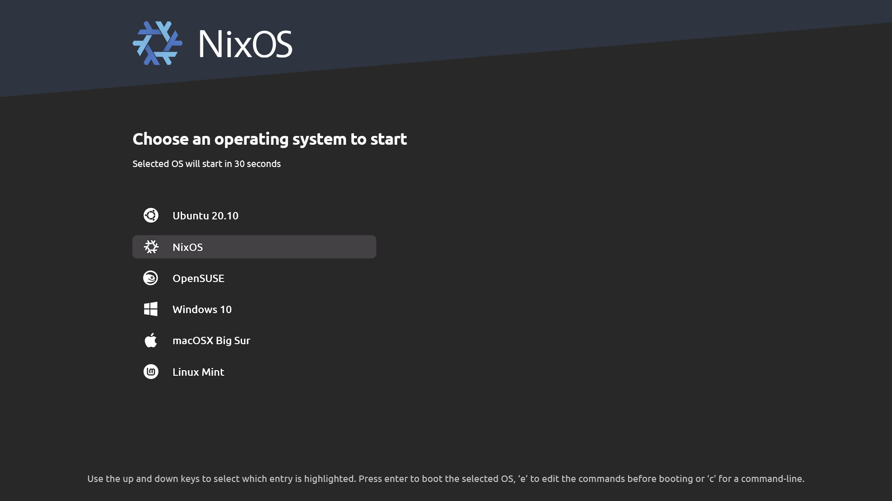
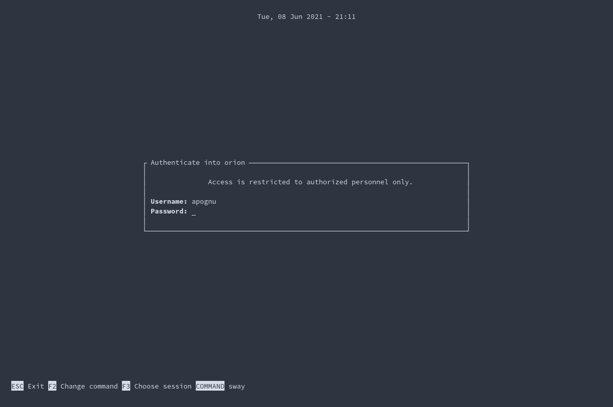

# Step 1
## [In the specified document](https://nixos.org/manual/nixos/stable/), go to the "nixos-generate-config --root /mnt" stage. Then do the things I mentioned.

# Step 2
```bash
cd /etc/nixos/
```

# Step 3
```bash
nix-shell -p git
```

# Step 4
```bash
rm -rf configuration.nix
git clone https://github.com/wioenena-q/wos
mv wos/* .
rm -rf wos
mv hardware-configuration.nix ./hosts/wos/
nixos-install --flake .#wos
```

# Step 5
## After nixos-install command
```bash
exit
cd
umount -R /mnt
poweroff
```

# After basic installation, open tty.

# Step 6
```bash
nmcli device wifi connect <ssid> password <password>
cd /etc/nixos
rm -rf ~/.config
home-manager switch --flake .#wioenena
xdg-user-dirs-update
```

# Images
## GRUB

## Tuigreet

